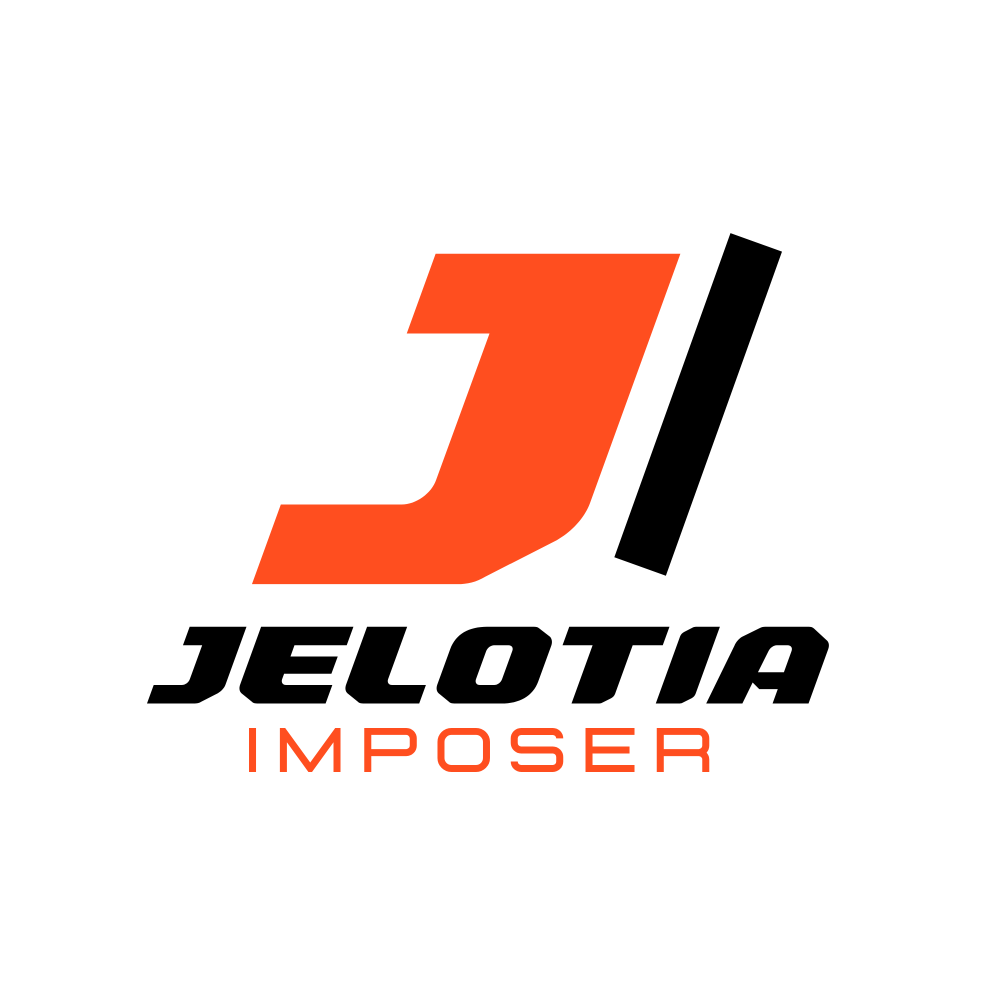

<p align="center">
  
  <p align="center">
    <strong>Le Logiciel Professionnel d'Imposition Automatique Industrielle & Pré-Presse Haute Cadence pour l'Impression Numérique & le Grand Format</strong>
  </p>
</p>

<p align="center">
  <a href="https://github.com/auceps-dev-team/JELOTIA-IMPOSER"></a>
  <a href="https://github.com/auceps-dev-team/JELOTIA-IMPOSER/actions"></a>
  <a href="#-documentation-des-tests--qa"></a>
  <a href="LICENSE"></a>
  <a href="#-pourquoi-jelotia-imposer"></a>
  <a href="#-export-multi-format--compatibilité-rips"></a>
  <a href="#-stack-technologique-détaillée"></a>
  <a href="#-stack-technologique-détaillée"></a>
</p>

---

## 📋 Table des matières

- [Pourquoi Jelotia Imposer ?](#-pourquoi-jelotia-imposer)
- [À qui s'adresse Jelotia Imposer ?](#-à-qui-sadresse-jelotia-imposer)
- [Aperçu du Produit & Interface](#-aperçu-du-produit--interface)
- [Démarrage Rapide (Quick Start)](#-démarrage-rapide-quick-start)
- [Fonctionnalités Clés](#-fonctionnalités-clés)
- [Conçu pour la Scalabilité & l'Endurance](#-conçu-pour-la-scalabilité--lendurance)
- [Système de Preflight & Auto-Correction](#-système-de-preflight--auto-correction)
- [Moteur de Nesting 2D & Remplissage Optimisé](#-moteur-de-nesting-2d--remplissage-optimisé)
- [Repères Techniques & Workflows de Découpe](#-repères-techniques--workflows-de-découpe)
- [Export Multi-Format & Compatibilité RIPs](#-export-multi-format--compatibilité-rips)
- [Architecture de Gestion des Licences](#-architecture-de-gestion-des-licences)
- [Documentation des Tests & QA](#-documentation-des-tests--qa)
- [Stack Technologique Détaillée](#-stack-technologique-détaillée)
- [Feuille de Route (Roadmap 2026-2027)](#-feuille-de-route-roadmap-2026-2027)
- [Foire Aux Questions (FAQ)](#-foire-aux-questions-faq)
- [Installation & Configuration Locale](#-installation--configuration-locale)
- [Commandes Utiles](#-commandes-utiles)
- [Architecture du Dépôt](#-architecture-du-dépôt)
- [Contribution & Sécurité](#-contribution--sécurité)
- [Licence & Mentions Légales](#-licence--mentions-légales)
- [Prêt à Automatiser Votre Atelier d'Impression ?](#-prêt-à-automatiser-votre-atelier-dimpression)

---

## 🖨️ Pourquoi Jelotia Imposer ?

**Jelotia Imposer** est né au cœur des opérations de **JELOTIA SARL**, entreprise majeure spécialisée dans l'impression numérique, les supports publicitaires, les stickers, le grand format et la personnalisation d'objets à Abidjan (Côte d'Ivoire).

Dans une imprimerie moderne haute cadence, le traitement manuel des fichiers de pré-presse constitue le goulot d'étranglement le plus critique :
- Les contrôles de résolution (DPI) et d'espaces colorimétriques (RGB vs CMJN) consomment un temps précieux.
- Les erreurs de fond perdu ou d'alignement entraînent des réimpressions coûteuses.
- L'imposition manuelle sur les planches d'impression génère d'importantes pertes de matière première (vinyle, papier, bâche).

**Jelotia Imposer** résout définitivement ces défis à travers 3 piliers fondateurs :

- ⚡ **Cadence Industrielle** : Traitement automatique et continu jusqu'à **10 000 fichiers par jour** via des dossiers surveillés (Hot Folders 24/7) et un pipeline distribué sans aucun blocage d'interface.
- 🎯 **Précision Zéro Défaut** : Vérification qualité automatisée (Preflight), conversion colorimétrique ICC certifiée, rééchantillonnage et ajout dynamique de fond perdu (bleed).
- 💰 **Rentabilité Maximisée** : Algorithme de Nesting 2D (MaxRects & Guillotine bin packing) garantissant un taux de remplissage cible **≥ 75%**, réduisant drastiquement les chutes de médias coûteux.

---

## 🎯 À qui s'adresse Jelotia Imposer ?

1. **Ateliers d'Impression Numérique & Grand Format**
   > *"Automatisez le traitement de vos commandes de stickers, bâches publicitaires, affiches et panneaux. Déposez vos fichiers dans le Hot Folder et récupérez des planches prêtes à imprimer optimisées en quelques secondes."*

2. **Ateliers de Découpe & Signalétique (Print & Cut)**
   > *"Générez automatiquement les repères de découpe optique Graphtec ARMS (type 1 et type 2) ainsi que la couche de ton direct CutContour dédiée aux tables et traceurs de découpe."*

3. **Responsables Pré-Presse & Directeurs d'Exploitation**
   > *"Supervisez la file d'attente en temps réel, suivez les statistiques d'utilisation des médias et garantissez une compatibilité totale avec vos RIPs existants (Maintop, Caldera, Onyx, Wasatch)."*

---

## 📸 Aperçu du Produit & Interface

### 1. Tableau de Bord & Statistiques Temps Réel

*Suivi en direct des jobs traités, du volume de fichiers, du taux de remplissage moyen et de la durée d'exécution du pipeline.*

### 2. Gestionnaire de File d'Attente & Drag & Drop Interactif

*Importation fluide par glisser-déplacer, gestion des priorités, statut des workers en temps réel et contrôles de pause/reprise.*

### 3. Visualiseur Zoomable & Éditeur de Planches

*Visualisation vectorielle haute précision des planches générées, inspection du placement des visuels et contrôle des repères de coupe.*

---

## ⚡ Démarrage Rapide (Quick Start)

Lancez **Jelotia Imposer** en environnement de développement en moins de **2 minutes** grâce au gestionnaire de paquets haute performance `uv` :

```bash
# 1. Cloner le dépôt
git clone https://github.com/auceps-dev-team/JELOTIA-IMPOSER.git
cd JELOTIA-IMPOSER

# 2. Installer les dépendances et créer l'environnement virtuel avec uv
uv sync

# 3. Appliquer les migrations de base de données SQLite (Alembic)
uv run alembic upgrade head

# 4. Lancer l'application graphique Jelotia Imposer
uv run main.py
```

> **Création automatique des dossiers de travail au premier lancement :**
> - `C:\Jelotia\HotFolder\Input` (Dépôt des fichiers d'entrée)
> - `C:\Jelotia\HotFolder\Output` (Planches finales générées pour le RIP)
> - `C:\Jelotia\Archive` (Archivage automatique des fichiers traités)
> - `C:\Jelotia\Logs` (Fichiers de journalisation avec rotation)

---

## ✨ Fonctionnalités Clés

| Fonctionnalité | Description |
|---|---|
| **Hot Folder Automation** | Surveillance 24/7 d'un répertoire d'entrée via `watchdog` — le dépôt de fichiers déclenche instantanément le traitement |
| **Preflight 6 Axes** | Contrôle de la résolution (DPI), mode couleur (CMJN vs RGB), transparence, polices embarquées, dimensions et fond perdu |
| **Auto-Correction ICC & Bleed** | Conversion RGB → CMJN avec profil ICC, rééchantillonnage intelligent et ajout dynamique de fond perdu (2mm à 5mm) |
| **Nesting 2D MaxRects & Guillotine** | Bin packing optimisé (BSSF, BLSF, BAF, FFDH) réduisant les chutes avec taux de remplissage cible ≥ 75% |
| **Repères Graphtec ARMS** | Génération automatique des repères de repérage optique Type 1 et Type 2 pour traceurs de découpe Graphtec |
| **Couche CutContour (Spot Color)** | Intégration d'une couche de ton direct dédiée pour les workflows intégrés d'impression et découpe (Print & Cut) |
| **Mode TIFF Photoshop RIP** | Formatage TIFF ultra-compatible (`Predictor=2`, `RowsPerStrip=4`, `.tif`) pour les RIPs anciens (Maintop, Caldera, Onyx) |
| **Export Multi-Format RIP** | Génération directe vers PDF/X-1a, PDF/X-4, PDF Standard, TIFF LZW/RAW et JPEG Haute Qualité (95%) |
| **Tickets de Job JDF Lite XML** | Production automatique de fichiers XML JDF accompagnant chaque planche pour l'automatisation du RIP |
| **QR Code & Badges** | Module de génération de QR codes automatiques et imposition optimisée de planches de badges |
| **Serveur de Licences Cryptographique** | Authentification en ligne/hors-ligne avec licences signées cryptographiquement (RSA / AES-256) et empreinte machine |
| **Interface PySide6 (Qt 6.8)** | Interface utilisateur réactive avec thèmes clair et sombre, visualiseur de planches et filtres interactifs |

---

## 🏗 Conçu pour la Scalabilité & l'Endurance

- **Worker Pool Multiprocessing + Asyncio Queue** : Traitement multi-cœur haute performance où chaque worker CPU traite un job en isolation complète sans bloquer la boucle d'événements Qt principale.
- **Base de Données SQLite en Mode WAL (Write-Ahead Logging)** : Gestion d'accès concurrents fluide permettant l'écriture simultanée des workers et la lecture réactive de l'interface GUI sans aucun verrouillage de base de données.
- **End-to-End Type Safety & Data Integrity** : Modèles de domaine **Pydantic v2** stricts et immutables séparés de la couche de persistance SQLAlchemy ORM.
- **Résilience Hot Folder & Auto-Recovery** : Testé pour une surveillance continue de plus de 8 heures avec isolation automatique des fichiers corrompus dans le dossier `Error/` et reprise sur crash sans perte d'état.

---

## 🎨 Système de Preflight & Auto-Correction

Le moteur de preflight et de correction effectue un contrôle rigoureux et une normalisation automatique avant toute étape d'imposition.

```
Fichier Source (PDF / TIFF / PNG / JPEG)
    │
    ▼ ImportEngine
    Extraction des métadonnées : dimensions (mm), DPI, mode couleur, profil ICC
    │
    ▼ PreflightEngine (Validation 6 axes)
    ┌──────────────────────────────────────────────────────────┐
    │ 1. Résolution (DPI ≥ 300)   4. Polices embarquées (PDF)  │
    │ 2. Mode Couleur (CMJN)      5. Dimensions vs Gabarit     │
    │ 3. Transparence (Alpha)     6. Présence du Fond Perdu    │
    └──────────────────────────────────────────────────────────┘
    → Statut attribué : OK / WARNING / ERROR
    │
    ▼ CorrectionEngine (Normalisation automatique)
    - Conversion RGB → CMJN avec profil ICC spécifié (ex: Fogra39, Coated FOGRA27)
    - Rééchantillonnage d'image pour atteindre la résolution cible sans distorsion
    - Ajout de fond perdu automatique (bleed 2mm - 5mm) par miroir ou extension de bordure
    - Aplatissement de la transparence pour compatibilité RIP accrue
```

---

## 🧩 Moteur de Nesting 2D & Remplissage Optimisé

Le moteur `NestingEngine` s'appuie sur le pattern **Strategy** et la bibliothèque `rectpack` pour placer un nombre maximal de visuels sur chaque planche d'impression.

### Algorithmes d'Imposition Disponibles
- **MaxRects BSSF (Best Short Side Fit)** : Privilégie l'ajustement du plus petit côté du rectangle restant.
- **MaxRects BLSF (Best Long Side Fit)** : Privilégie l'ajustement du plus long côté du rectangle restant.
- **MaxRects BAF (Best Area Fit)** : Choisit l'emplacement qui laisse la plus petite surface résiduelle.
- **Guillotine FFDH (First Fit Decreasing Height)** : Découpe en bandes horizontales adaptée aux couteaux droits.

### Spécifications & Contraintes Metier
- **Taux de Remplissage Cible** : ≥ 75% sur l'ensemble du job.
- **Espacement Inter-Visuels** : Configurable de 0 mm à 20 mm (défaut : 3 mm).
- **Marges de Planche** : Définition des marges de sécurité sur les 4 bords du média.
- **Rotation Autorisée** : Basculement 0° / 90° désactivable selon la direction du grain du matériau.

---

## 📐 Repères Techniques & Workflows de Découpe

Jelotia Imposer intègre tous les outils nécessaires pour piloter les ateliers d'impression et de découpe automatisée :

1. **Repères Optiques Graphtec ARMS** :
   - Génération conforme aux standards Graphtec **ARMS Type 1** (4 repères d'angles) et **Type 2** (repères d'alignement continu).
   - Ajustement automatique de la longueur des repères et de la zone de sécurité optique.

2. **Couche de Découpe "CutContour"** :
   - Insertion d'une couleur d'accompagnement (Spot Color / Ton direct) nommée `CutContour` (100% Magenta).
   - Reconnue automatiquement par les logiciels de traçage et de découpe (FlexiSign, VersaWorks, Onyx CutServer).

3. **Repères de Coupe & Cartouche Métadonnées** :
   - Croix de coupe vectorielles imprimées à l'extérieur du visuel.
   - En-tête informatif sur chaque planche : `[Nom du Job] - Planche X/Y - Date - Dimensions - Taux de Remplissage`.

---

## 🖨 Export Multi-Format & Compatibilité RIPs

Le moteur `ExportEngine` produit des fichiers directement utilisables par les matériels d'impression numérique grands formats et industriels.

| Format d'Export | Utilisation & Spécificités | RIPs Compatibles |
|---|---|---|
| **PDF/X-4** | Norme pré-presse moderne avec préservation des transparences et profils ICC embarqués | Caldera, Onyx, EFI Fiery, Harlequin |
| **PDF/X-1a** | Norme pré-presse ISO stricte (force le mode CMJN, aplatit les transparences) | Tous RIPs récents et anciens |
| **Mode TIFF Photoshop** | Fichier `.tif` raster haute définition avec `Predictor=2` et `RowsPerStrip=4` sans tags non-standards | Maintop RIP, Wasatch, Caldera, Onyx |
| **TIFF LZW / RAW** | Compression sans perte pour gros volumes raster CMJN | Maintop, FlexiPrint, Photoprint |
| **JPEG High Quality** | Rendu raster compressé à 95% pour validation visuelle rapide ou tirage économique | Impression directe & RIPs génériques |
| **Tickets JDF Lite XML** | Fichier XML `.jdf` généré aux côtés de la planche pour l'automatisation des flux RIP | JDF Workflow Processors |

---

## 🔒 Architecture de Gestion des Licences

Jelotia Imposer comprend un système d'activation et de gestion des licences d'entreprise hautement sécurisé :

- **Serveur d'Activation Dédié (`activation_server/`)** : Service web léger développé avec FastAPI, Uvicorn et Cryptography.
- **Empreinte Matérielle (System Fingerprint)** : Génération d'une clé d'identification unique basée sur les composants du poste (UUID carte mère, processeur, adresse MAC).
- **Licences Signées Cryptographiquement (RSA / AES-256)** : Vérification de la signature numérique de la licence en local sans nécessiter de connexion internet permanente.
- **Support des Licences Temporaires & Permanentes** : Gestion de la période de validité, du nombre maximal de postes autorisés et des fonctionnalités activées.

---

## 🧪 Documentation des Tests & QA

Jelotia Imposer applique des règles d'assurance qualité exigeantes garantissant la stabilité du logiciel en production.

### Vue d'ensemble des Suites de Tests

#### 1. Tests Unitaires (`pytest`)
Couverture ciblée de la logique métier des moteurs de pré-presse, des algorithmes de nesting et des modèles de données.
- **Framework** : Pytest + Pytest-Asyncio + Pytest-Cov
- **Emplacement** : `tests/unit/`
- **Commande d'exécution** :
  ```bash
  uv run pytest tests/unit/ --cov=src --cov-report=html
  ```

#### 2. Tests d'Intégration & Scénarios End-to-End
Validation du cycle complet depuis l'importation dans le Hot Folder jusqu'à la génération des planches finales.
- **Emplacement** : `tests/integration/`
- **Scénarios couverts** :
  - Traitement d'un dossier mixte de 500 fichiers PDF/TIFF/JPEG.
  - Endurance Hot Folder (surveillance continue sous flux de fichiers).
  - Reprise sur crash process (Crash Recovery & Database Consistency).
  - Test de charge et d'isolation des workers parallèles (8 workers).

#### 3. Benchmarks de Performance
Mesure des temps d'exécution et profiling de mémoire sous forte charge (cible de 10 000 fichiers/jour).
- **Script** : `scripts/benchmark_runner.py`
- **Commande d'exécution** :
  ```bash
  uv run python scripts/benchmark_runner.py --files 1000 --workers 4
  ```

---

## 💻 Stack Technologique Détaillée

| Composant / Module | Technologie | Version | Rôle dans le projet |
|---|---|---|---|
| **Langage principal** | Python | ≥ 3.12 | Cœur applicatif et traitement distribué |
| **Interface Graphique** | PySide6 (Qt 6.8) | ≥ 6.8.1 | Interface réactive, composants UI et thèmes |
| **Analyse & Rendu PDF** | PyMuPDF (fitz) | 1.28.0 | Lecture PDF ultra-rapide, extraction et métadonnées |
| **Édition PDF Bas-Niveau** | pikepdf | ≥ 9.4.2 | Manipulation de la structure PDF, OutputIntent, PDF/X |
| **Génération Vectorielle PDF** | ReportLab | ≥ 4.2.5 | Tracé des repères de coupe, Graphtec ARMS et métadonnées |
| **Traitement d'Image Raster** | Pillow (PIL) | ≥ 11.0.0 | Manipulations raster, conversions CMJN et compression TIFF |
| **Vision & Traitement d'Image** | OpenCV | ≥ 4.10.0 | Extension de fond perdu (bleed) et détection de contours |
| **Algorithme de Nesting 2D** | rectpack | 0.2.2 | Bin packing 2D (MaxRects & Guillotine) |
| **Calculs Géométriques** | Shapely | ≥ 2.0.6 | Opérations spatiales vectorielles et calculs de découpe |
| **Science des Couleurs & ICC** | colour-science | ≥ 0.4.4 | Gestion et conversion des profils colorimétriques ICC |
| **Base de Données** | SQLite + SQLAlchemy | ≥ 2.0.36 | Persistence locale avec ORM et mode WAL |
| **Migrations DB** | Alembic | ≥ 1.14.0 | Suivi des évolutions du schéma de base de données |
| **Validation des Données** | Pydantic v2 | ≥ 2.10.4 | Modèles de domaine stricts et validation JSON |
| **Surveillance Fichiers** | watchdog | ≥ 6.0.0 | Observation temps réel des répertoires Hot Folder |
| **Gestionnaire de Paquets** | uv | Latest | Installation et gestion rapide des dépendances |

---

## 🗺 Feuille de Route (Roadmap 2026-2027)

- [x] **T1 2026** : Architecture distribuée Multiprocessing, Moteur Nesting MaxRects 2D, Preflight 6 axes, UI PySide6.
- [x] **T2 2026** : Exportateur PDF/X-1a & PDF/X-4, Mode TIFF Photoshop RIP, Repères Graphtec ARMS, Couche CutContour.
- [x] **T3 2026** : Serveur de licences d'entreprise cryptographique, Génération de tickets JDF XML, Hot Folder 24/7.
- [ ] **T4 2026** : Algorithme de Nesting "True-Shape" (Imposition géométrique de formes vectorielles complexes non rectangulaires).
- [ ] **T1 2027** : Dashboard Cloud distant & API Web GraphQL pour le suivi multi-sites des ateliers d'impression.

---

## ❓ Foire Aux Questions (FAQ)

**Q : Jelotia Imposer est-il compatible avec les RIPs plus anciens comme Maintop ?**  
R : Oui ! Grâce à notre **Mode TIFF Photoshop**, les planches sont générées au format `.tif` avec une structuration par bandes (`RowsPerStrip=4`, `Predictor=2`) parfaitement assimilée par les moteurs d'importation des RIPs anciens.

**Q : Comment configurer le Hot Folder pour qu'il s'exécute en arrière-plan ?**  
R : Dans le panneau **Paramètres**, définissez le chemin de votre dossier d'entrée (`Input`), de sortie (`Output`) et d'archivage (`Archive`). Activez l'option *Surveillance Hot Folder* et l'application traitera automatiquement tout fichier déposé.

**Q : Que se passe-t-il si un fichier soumis est corrompu ou invalide ?**  
R : Le moteur de Preflight détecte l'anomalie, attribue le statut `ERROR`, consigne l'erreur détaillée dans la base de données et déplace le fichier problématique vers le dossier `C:\Jelotia\HotFolder\Error` sans jamais interrompre le pipeline pour les autres fichiers.

**Q : Peut-on utiliser Jelotia Imposer sur plusieurs postes de travail ?**  
R : L'application peut être déployée sur plusieurs postes via notre serveur de licences (`activation_server`). Chaque licence est associée à l'empreinte matérielle unique du poste client.

---

## 🚀 Installation & Configuration Locale

### Configuration Système Recommandée

| Composant | Minimum requis | Recommandé pour 10k fichiers/jour |
|---|---|---|
| **Système d'exploitation** | Windows 10 64-bit | Windows 11 64-bit / Windows Server 2022 |
| **Processeur (CPU)** | 4 cœurs / 2.5 GHz | 8 cœurs à 16 cœurs / 3.5 GHz+ |
| **Mémoire RAM** | 8 Go | 16 Go à 32 Go |
| **Disque dur** | 1 Go libre (App) | SSD NVMe 500 Go+ (pour les sorties RIP lourdes) |
| **Python** | Version 3.12+ | Version 3.12+ |

### Fichier de Configuration (`config.json`)

Le fichier de configuration principal est auto-généré à la racine lors du premier lancement. Il est facilement modifiable depuis l'interface graphique via l'onglet **Paramètres** :

```json
{
  "paths": {
    "input": "C:\\Jelotia\\HotFolder\\Input",
    "output": "C:\\Jelotia\\HotFolder\\Output",
    "archive": "C:\\Jelotia\\Archive",
    "logs": "C:\\Jelotia\\Logs"
  },
  "imposition": {
    "sheet_width": 550,
    "sheet_height": 890,
    "spacing": 3,
    "margin": 0,
    "rotation_allowed": true,
    "plotter_marks": "graphtec_type1",
    "plotter_mark_length": 15,
    "add_bleed": 2.0
  },
  "preflight": {
    "min_dpi": 300,
    "allowed_formats": "PDF, TIFF, PNG, JPEG"
  },
  "export": {
    "format": "PDF/X-4",
    "dpi": 300,
    "icc_profile": "Fogra39",
    "tiff_compression": "tiff_lzw",
    "tiff_photoshop_compat": true,
    "jpeg_color_mode": "CMYK",
    "pdf_rasterize": false,
    "cut_contour": true
  },
  "performance": {
    "workers": 4,
    "memory_limit_mb": 4096
  },
  "ui": {
    "theme": "dark"
  }
}
```

---

## 🛠 Commandes Utiles

```bash
# Lancement de l'application en mode développement
uv run main.py

# Exécution de l'ensemble des tests unitaires et d'intégration (282+ tests)
uv run pytest tests/

# Génération du rapport de couverture de code HTML
uv run pytest tests/--cov=src --cov-report=html

# Création d'une nouvelle migration de base de données avec Alembic
uv run alembic revision --autogenerate -m "Description de la modification"

# Application des migrations de base de données
uv run alembic upgrade head

# Lancement des benchmarks de performance et mesure de débit
uv run python scripts/benchmark_runner.py

# Compilation de l'exécutable autonome Windows avec PyInstaller
uv run pyinstaller --noconfirm installer/jelotia_imposer.spec
```

---

## 📁 Architecture du Dépôt

```text
jelotia-imposer/
├── main.py                        # Point d'entrée principal de l'application
├── pyproject.toml                 # Spécification des dépendances et outils (uv / ruff / pytest)
├── config.json                    # Configuration système principale
├── alembic.ini                    # Fichier de configuration des migrations Alembic
│
├── src/                           # Code source principal
│   ├── core/                      # Logique métier pure & moteurs pré-presse
│   │   ├── engines/               # Moteurs spécialisés
│   │   │   ├── import_engine.py   # Extraction des métadonnées & lecture de fichiers
│   │   │   ├── preflight_engine.py# Contrôle qualité & validation 6 axes
│   │   │   ├── correction_engine.py# Normalisation, profils ICC & fond perdu
│   │   │   ├── nesting_engine.py  # Algorithmes de bin packing 2D (MaxRects / Guillotine)
│   │   │   ├── layout_engine.py   # Génération des planches PDF avec repères vectoriels
│   │   │   ├── export_engine.py   # Convertisseur final RIP (PDF/X, TIFF, JPEG)
│   │   │   ├── icc_engine.py      # Gestionnaire de profils colorimétriques ICC
│   │   │   ├── bleed_engine.py    # Calculateur et générateur de fond perdu
│   │   │   └── pdf_editor.py      # Éditeur de structure PDF bas-niveau
│   │   ├── models/                # Modèles de domaine stricts Pydantic v2
│   │   │   └── domain.py          # Structures Job, FileItem, Sheet, JobSettings
│   │   ├── processors/            # Processeurs d'exécution
│   │   │   ├── job_processor.py   # Orchestrateur séquentiel du pipeline par job
│   │   │   └── worker_pool.py     # Gestionnaire du pool multiprocessing + asyncio
│   │   ├── auto_processor.py      # Groupement automatique des fichiers entrants
│   │   ├── output_manager.py      # Gestionnaire d'archivage & sorties RIP
│   │   └── worker_thread.py       # Passerelle de communication QThread ↔ asyncio
│   │
│   ├── database/                  # Couche de persistance des données
│   │   ├── models.py              # Modèles ORM SQLAlchemy (Jobs, FileItems, Sheets)
│   │   ├── repository.py          # Modèle Repository (JobRepository)
│   │   └── migrations/            # Historique des migrations Alembic
│   │
│   ├── ui/                        # Interface Utilisateur PySide6 (Qt 6.8)
│   │   ├── main_window.py         # Fenêtre principale et routage des vues
│   │   ├── theme.py               # Gestionnaire des thèmes clair / sombre
│   │   └── widgets/               # Composants graphiques et vues
│   │       ├── dashboard.py       # Tableau de bord des statistiques
│   │       ├── job_queue.py       # Vues de la file d'attente & Drag & Drop
│   │       ├── job_dialog.py      # Modal de création de job sur-mesure
│   │       ├── sheet_preview.py   # Visualiseur zoomable des planches vectorielles
│   │       ├── preflight_report.py# Rapport interactif d'anomalies preflight
│   │       └── settings_view.py   # Interface de configuration complète
│   │
│   └── utils/                     # Utilitaires système et helpers
│       ├── config.py              # Constantes et chemins système
│       ├── config_manager.py      # Gestionnaire d'E/S du fichier config.json
│       └── file_utils.py          # Manipulation système de fichiers
│
├── tests/                         # Suite de tests automatisés
│   ├── unit/                      # Tests unitaires par moteur
│   └── integration/               # Tests d'intégration end-to-end & Hot Folder
│
├── docs/                          # Documentation technique & opérationnelle
│   ├── documentation_technique.md # Architecture interne & spécifications d'API
│   ├── manuel_installation.md     # Procédure détaillée d'installation
│   ├── manuel_utilisateur.md      # Guide d'utilisation pour les opérateurs
│   ├── procedure_maintenance.md   # Guide de maintenance et procédures de sauvegarde
│   └── QA_tests.md                # Cahier de recettes et plan de tests QA
│
├── scripts/                       # Scripts utilitaires d'automatisation
│   ├── bump_version.py            # Automation de l'incrémentation de version
│   └── benchmark_runner.py        # Outil de test de charge et de performance
│
├── installer/                     # Configuration de déploiement et d'installation
│   ├── jelotia_imposer.spec       # Fichier de spécification PyInstaller
│   └── jelotia_imposer.iss        # Script Inno Setup (Générateur d'installeur Windows)
│
└── activation_server/             # Infrastructure du serveur de licences d'entreprise
```

---

## 🤝 Contribution & Sécurité

Les contributions au projet **Jelotia Imposer** sont strictly gérées selon les standards d'ingénierie de Jelotia SARL :

1. **Branchement Git** : Créez une branche dédiée pour chaque fonctionnalité (`feature/nom-fonctionnalite`) ou correctif (`fix/description-correctif`).
2. **Qualité de Code** : Assurez-vous que le formateur et le linter `ruff` ne remontent aucune alerte :
   ```bash
   uv run ruff check .
   ```
3. **Validation des Tests** : Tout ajout de code doit s'accompagner de tests unitaires ou d'intégration et maintenir une couverture ≥ 80%.
4. **Signalement de Sécurité** : Pour signaler une vulnérabilité relative au serveur de licences ou à la gestion des données, contactez directement l'équipe technique à `security@jelotia.com`.

---

## 📄 Licence & Mentions Légales

Ce logiciel est une propriété exclusive de **JELOTIA SARL**.  
Tous droits réservés. L'utilisation, la copie, la modification ou la distribution non autorisée de ce logiciel ou de ses composants est strictement interdite sans une licence accordée par Jelotia SARL.

Développé et maintenu par **Auceps Digital Dev Team** pour **Jelotia SARL**.

---

## 🚀 Prêt à Automatiser Votre Atelier d'Impression ?

Transformez la productivité de votre pré-presse, éliminez les erreurs humaines et maximisez le rendement de vos supports d'impression avec Jelotia Imposer.

- 🌐 **Site Web Officiel** : [jelotia.com](https://jelotia.com)
- 📅 **Demander une Démonstration** : Contactez notre équipe commerciale
- 💬 **Support Technique** : `support-imposer@jelotia.com`
- 📧 **Directeur d'Ingénierie** : `dev.team@auceps-digital.agency`

**Fait avec passion, rigueur et 🖨️ à Abidjan, Côte d'Ivoire.**
